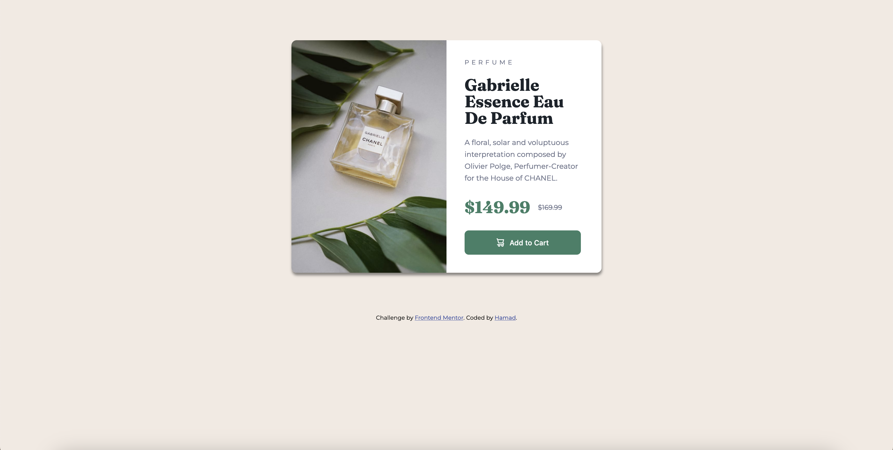
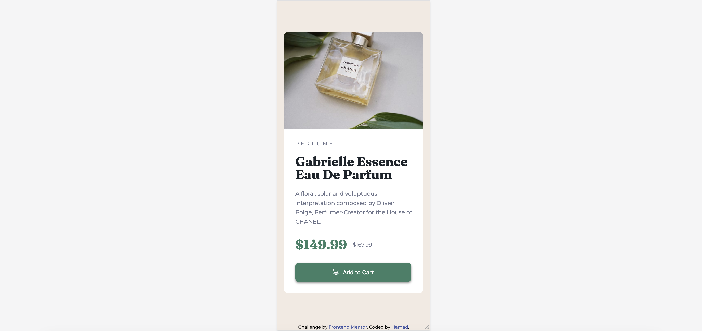

# Frontend Mentor - Product preview card component solution

This is a solution to the [Product preview card component challenge on Frontend Mentor](https://www.frontendmentor.io/challenges/product-preview-card-component-GO7UmttRfa). Frontend Mentor challenges help you improve your coding skills by building realistic projects.

## Table of contents

- [Overview](#overview)
  - [The challenge](#the-challenge)
  - [Screenshot](#screenshot)
  - [Built with](#built-with)
  - [What I learned](#what-i-learned)
  - [Continued development](#continued-development)
- [Author](#author)

## Overview

Building and styling a responsive product component

### The challenge

Users should be able to:

- View the optimal layout depending on their device's screen size
- See hover and focus states for interactive elements

### Screenshot

### Built with

- Semantic HTML5 markup
- CSS custom properties
- Flexbox

### What I learned

Getting hands on practice using HTML and CSS on my own.
working with box-shadow and understanding its use, vertical, horizontal, blur, and color.

swapping images on a different screen width with:
content: url("image.jpg");

### Continued development

Once I learn react I would do this (probably on a smilar challenge) and make it responsive for a range of different sizes not just 1440px and 375px

## Author

- github - [@HamadSMA](https://github.com/HamadSMA)
- Frontend Mentor - [@HamadSMA](https://www.frontendmentor.io/profile/HamadSMA)
